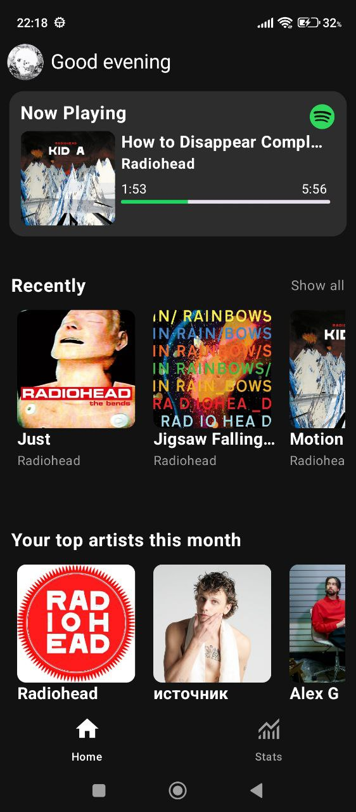
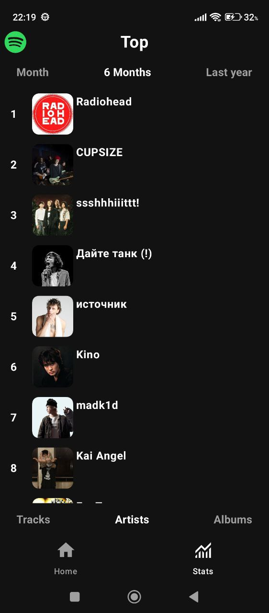
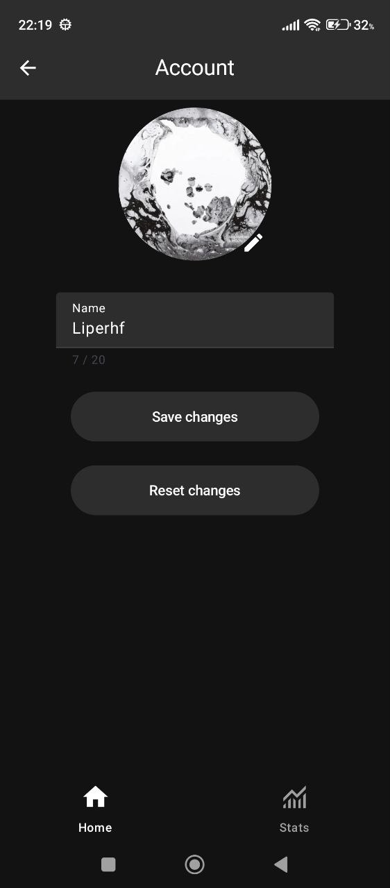
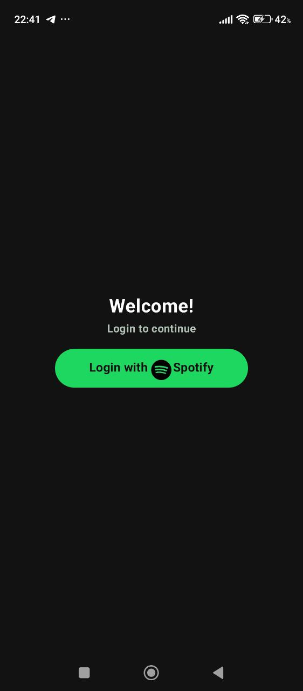

# 🎵 SpotiStats

<!-- Curated top section for recruiters (EN) -->

# 📖 Contents

<ul>
  <li><a href="#-about">About</a></li>
  <li><a href="#-demonstration">Demonstration</a></li>
  <li><a href="#-features">Features</a></li>
  <li><a href="#-tech-stack">Tech Stack</a></li>
  <li><a href="#-local-development">Local Development</a></li>
</ul>

# 📜 About

SpotiStats is an Android application for analyzing your Spotify listening statistics. It provides insights into top tracks, artists, albums, and recently played songs using Spotify Web API, with a clean Material Design 3 interface built entirely on Jetpack Compose.

# 📱 Demonstration

<div align="center">
  
  
  
</div>

<div align="center">
  
  
  
</div>

# ✨ Features

- 📊 View detailed listening statistics by time range
- 🎨 Material Design 3 UI with Jetpack Compose
- 🔐 Secure Spotify OAuth 2.0 authentication
- 📱 Adaptive layout for different screen sizes
- 🌐 Multi-language support
- 💾 Offline cache with Room database
- 🎵 Recently played history tracking

# 🛠 Tech Stack

**Languages & Frameworks**
- Kotlin, Jetpack Compose, Coroutines, Flow/StateFlow

**Architecture & Patterns**
- Clean Architecture (app/data/domain), MVVM, Repository Pattern, Dependency Injection (Hilt)

**Networking & API**
- Retrofit2, OkHttp (logging), Gson, Spotify Web API, OAuth 2.0

**Database & Storage**
- Room (cache/offline), DataStore Preferences

**UI & UX**
- Material Design 3, Coil (image loading), Accompanist, UCrop (image cropping)

**Testing**
- JUnit4, MockK/Mockito, Coroutines Test, basic Compose UI Tests

# 💻 Local Development

1) Clone the repository
```bash
git clone https://github.com/Liperhf/SpotiStats.git
cd SpotiStats
```

2) Create a Spotify Developer App
- Go to Spotify Developer Dashboard
- Create a new app and set Redirect URI: `spotistats://callback`

3) Set up configuration
Create `local.properties` in the project root and add:
```properties
SPOTIFY_CLIENT_ID=your_client_id
SPOTIFY_CLIENT_SECRET=your_client_secret
SPOTIFY_REDIRECT_URI=spotistats://callback
```

4) Build & run the app
- Open the project in Android Studio
- Select a device (emulator or physical)
- Click Run ▶

## 📋 API Requirements

The application uses the following Spotify Web API endpoints:
- `GET /v1/me` — user information
- `GET /v1/me/top/tracks` — user's top tracks
- `GET /v1/me/top/artists` — user's top artists
- `GET /v1/me/player/recently-played` — user's recently played tracks

## 🔧 Build Configuration

- **Minimum SDK:** API 26 (Android 8.0)
- **Target SDK:** API 35 (Android 15)
- **Compile SDK:** API 35
- **Java Version:** 17
- **Kotlin Version:** 2.0.0

## 📝 License

This project is created for educational purposes and demonstrates modern approaches to Android app development.

## 👨‍💻 Author

**Your Name** - Android Developer

- 📧 Email: your.email@example.com
- 💼 LinkedIn: [your-linkedin-profile](https://linkedin.com/in/your-profile)
- 🐙 GitHub: [@yourusername](https://github.com/yourusername)

---

<div align="center">
  <p>Created with ❤️ using modern Android technologies</p>
</div>
